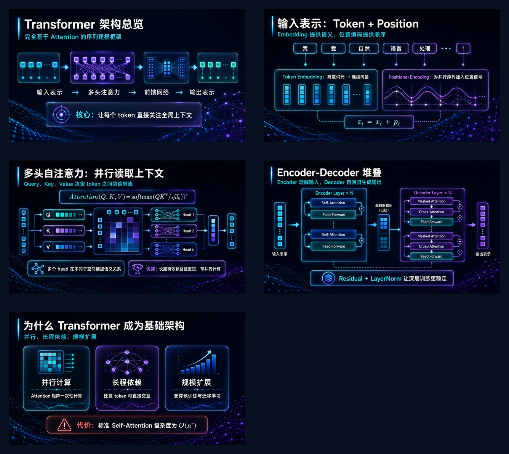

<p align="center">
  
  
  
  
  
</p>

<p align="center">
  <!--
  <a href="https://linux.do" alt="LINUX DO">
    
  </a>
  -->
  <a href="https://linux.do/t/topic/1777230">
    
  </a>
</p>

<h1 align="center">Awesome PPT Skills</h1>

<p align="center">
  把一句提示词变成精美的整页图片版 PPT。
  使用 <code>$awesome-ppt-std</code> 走稳定图片版流程；
  使用 <code>$awesome-ppt-editable</code> 走实验性的 <code>ppt-master</code> 可编辑重建流程。
</p>

<p align="center">
  <a href="README.md">English</a> | <strong>中文</strong>
</p>

## 概览

Awesome PPT 是一个面向 Codex 的 PPT 生成 skill。它的核心思路是让 `gpt-image-2` 直接生成完整幻灯片页面，包括标题、正文、标签、图示和视觉风格，然后再把这些整页图片组装成 `.pptx`。

仓库提供两个明确命令：

- `$awesome-ppt-std`：稳定的图片版流程，生成整页图片并组装成 PPTX。
- `$awesome-ppt-editable`：实验性的可编辑流程，先完整跑标准流程，再导出 brief 给 [`ppt-master`](https://github.com/hugohe3/ppt-master)，重建为原生可编辑文本、形状、图表和对象。

`$awesome-ppt` 保留为向后兼容的核心命令；新用户建议优先使用 `-std` 或 `-editable`。

## 优势

- 整页成图：不是只生成背景，而是让模型直接设计完整 PPT 页面。
- 文本进 prompt：每个可见标题、要点、标签和注释都会写进生图 prompt。
- 主题风格识别：先识别 PPT 主题，再参考内置风格 prompt 库做定制化设计。
- 快速组装：用轻量脚本把生成图片打包成 PPTX。
- 可编辑优化：生成图作为 `ppt-master` 的视觉参考，`rendered_text` 作为原生可编辑文本来源。
- 命令隔离：标准流程和可编辑重建流程拆开，避免不稳定的重建行为影响稳定生图链路。
- 可复现：`deck.json` 保留页数、文案、prompt 和图片路径，方便重建和迭代。

## 安装

克隆仓库：

```bash
git clone https://github.com/stevenjinlong/awesome-ppt-skills.git
cd awesome-ppt-skills
```

安装到 Codex：

```bash
mkdir -p "${CODEX_HOME:-$HOME/.codex}/skills"
for skill in awesome-ppt awesome-ppt-std awesome-ppt-editable; do
  ln -sfn "$PWD/$skill" "${CODEX_HOME:-$HOME/.codex}/skills/$skill"
done
```

重启 Codex，或者打开一个新的 Codex 会话，让 skill 被重新发现。

`$awesome-ppt-std` 只依赖本仓库即可使用。`$awesome-ppt-editable` 还需要把上游 [`ppt-master`](https://github.com/hugohe3/ppt-master) skill 安装或 symlink 到 Codex。

## 使用

生成标准图片版 PPT：

```text
$awesome-ppt-std 做一个 5 页 PPT，主要介绍 Transformer，从历史到架构到应用，要偏技术风。所有标题、正文、标签都必须由 gpt-image-2 直接生成在每页图片里。 --pages 5 --ratio 16:9 --lang zh
```

生成图片版 PPTX 后，再让 `ppt-master` 重建可编辑版本：

```text
$awesome-ppt-editable 做一个 5 页 PPT，主要介绍 Transformer，要偏技术风。先生成高质量图片版 PPTX，再用 ppt-master 优化成原生可编辑 PPTX。 --pages 5 --ratio 16:9 --lang zh
```

也可以指定输出路径：

```text
$awesome-ppt-std 做一个 8 页中文产品发布会 PPT，科技感、电影感、少字大图。 --pages 8 --ratio 16:9 --lang zh --out awesome-ppt-output/product-launch/product-launch.pptx
```

## 示例：Transformer 架构

这是用 `$awesome-ppt-std` 生成的 5 页 Transformer 架构图片版 PPT 示例。所有可见文字和图示都直接渲染在每页幻灯片图片中，然后再组装成 PPTX。

```text
$awesome-ppt-std 做一个介绍 Transformer 架构的 PPT，5 页左右，要求技术风，有文本。 --pages 5 --ratio 16:9 --lang zh
```

<p align="center">
  
</p>

## 输出结构

```text
awesome-ppt-output/<deck-slug>/
  deck.json
  images/
    slide-01.png
    slide-02.png
  <deck-slug>.pptx                  # 图片版 PPTX
  ppt-master-handoff/
    ppt-master-brief.md
    ppt-master-request.md
    images/
      slide-01.png
  ppt-master-rebuild/               # 仅可编辑模式，由 ppt-master 创建
  <deck-slug>-editable.pptx          # 可编辑模式输出，如已生成
```

`awesome-ppt-output/` 是本地运行和测试输出目录，已被 Git 忽略。README 展示图单独放在 `examples/` 下，可以安全发布。

## 手动构建

脚本只使用 Python 标准库：

```bash
python scripts/validate_skill_package.py
python awesome-ppt/scripts/validate_deck.py awesome-ppt-output/my-deck/deck.json
python awesome-ppt/scripts/build_deck.py awesome-ppt-output/my-deck/deck.json --out awesome-ppt-output/my-deck/my-deck.pptx
python awesome-ppt/scripts/export_ppt_master_handoff.py awesome-ppt-output/my-deck/deck.json
python awesome-ppt/scripts/inspect_pptx_package.py awesome-ppt-output/my-deck/my-deck.pptx --expect-slides 5 --max-media 5
```

## 当前范围

- 支持 PNG 和 JPEG。
- 支持 16:9、4:3、1:1。
- 默认可见内容层是带文字的整页生成图片。
- 可选增加 PPT 原生文本框作为辅助层。
- 可编辑优化：`$awesome-ppt-editable` 在图片版 deck 生成后导出 `ppt-master` 重建 handoff。它依赖 `ppt-master`，不是无损位图转矢量。
- 后续可加入 OCR 文本校验、备注页写入、文件内容抽取、模板和更复杂的图表流程。

## Star History

<a href="https://www.star-history.com/#stevenjinlong/awesome-ppt-skills&Date">
  <picture>
    <source media="(prefers-color-scheme: dark)" srcset="https://api.star-history.com/svg?repos=stevenjinlong/awesome-ppt-skills&type=Date&theme=dark" />
    <source media="(prefers-color-scheme: light)" srcset="https://api.star-history.com/svg?repos=stevenjinlong/awesome-ppt-skills&type=Date" />
    
  </picture>
</a>
